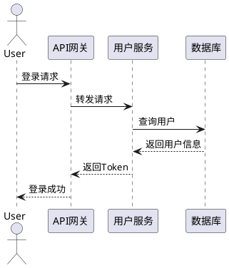
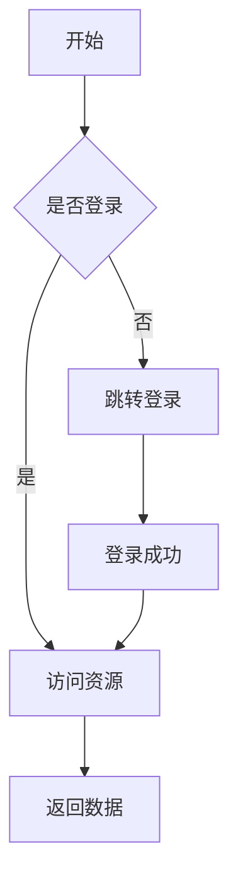

# 架构图

本目录存放系统架构图、流程图、时序图等可视化设计文档。

## 图表列表

### 系统架构图
**文件**：`system-architecture.drawio`
**状态**：⬜ 未创建

**内容**：
- 整体系统架构
- 各组件关系
- 技术栈标注

---

### 微服务架构图
**文件**：`microservice-architecture.drawio`
**状态**：⬜ 未创建

**内容**：
- 微服务划分
- 服务调用关系
- 数据流向

---

### 部署架构图
**文件**：`deployment-architecture.drawio`
**状态**：⬜ 未创建

**内容**：
- 生产环境部署
- 网络拓扑
- 容器编排

---

### 时序图
**文件**：`sequence-diagrams.drawio`
**状态**：⬜ 未创建

**内容**：
- 核心业务流程
- 服务调用时序
- 异常处理流程

---

## 使用说明

### 推荐工具
- **Draw.io**：免费在线绘图工具
- **ProcessOn**：在线协作绘图
- **PlantUML**：代码生成UML图
- **Mermaid**：Markdown嵌入图表

### Draw.io使用
```bash
# 在线使用
https://app.diagrams.net/

# 本地使用
brew install drawio  # macOS
choco install drawio # Windows
```

### PlantUML示例


### Mermaid示例


---

## 架构图模板

### 系统架构图模板
```
┌─────────────────────────────────────────────────┐
│                   客户端层                        │
│  Web | H5 | App | 小程序                         │
└───────────────────┬─────────────────────────────┘
                    │ HTTP/HTTPS
┌───────────────────▼─────────────────────────────┐
│                   网关层                          │
│  Nginx | API Gateway | CDN                       │
└───────────────────┬─────────────────────────────┘
                    │
┌───────────────────▼─────────────────────────────┐
│                   应用层                          │
│  ┌──────────┐  ┌──────────┐  ┌──────────┐      │
│  │ 服务A    │  │ 服务B    │  │ 服务C    │      │
│  └──────────┘  └──────────┘  └──────────┘      │
└───────────────────┬─────────────────────────────┘
                    │
┌───────────────────▼─────────────────────────────┐
│                   中间件层                        │
│  ┌──────────┐  ┌──────────┐  ┌──────────┐      │
│  │ Redis    │  │ MQ       │  │ ES       │      │
│  └──────────┘  └──────────┘  └──────────┘      │
└───────────────────┬─────────────────────────────┘
                    │
┌───────────────────▼─────────────────────────────┐
│                   数据层                          │
│  ┌──────────┐  ┌──────────┐  ┌──────────┐      │
│  │ MySQL    │  │ MongoDB  │  │ HBase    │      │
│  └──────────┘  └──────────┘  └──────────┘      │
└─────────────────────────────────────────────────┘
```

---

## 图表命名规范

- `system-architecture.drawio` - 系统架构图
- `microservice-architecture.drawio` - 微服务架构图
- `deployment-architecture.drawio` - 部署架构图
- `sequence-*.drawio` - 时序图
- `flow-*.drawio` - 流程图
- `er-*.drawio` - ER图

---

## 导出格式

建议导出为以下格式：
- PNG（演示使用）
- SVG（可缩放）
- PDF（文档使用）
- Draw.io源文件（编辑使用）
